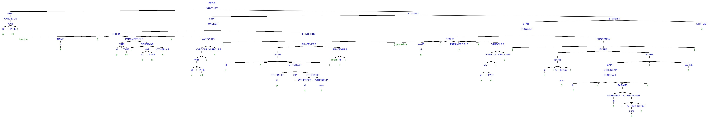
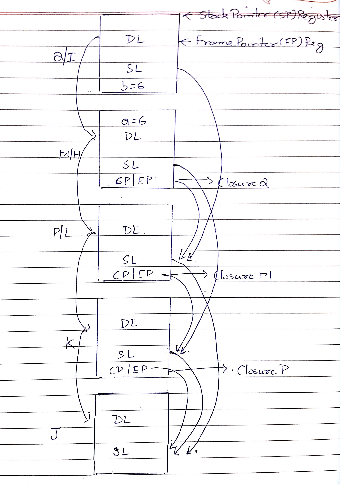

#### Amanpreet Singh
#### as10656, N18196113
#### Programming Languages Homework 1


### Exercise 1


a)  `[a-z]*[A-Z][a-z]*[A-Z][a-z]*[0-9][a-z]*`

b) `[A-Za-z]([A-za-z0-9_] | ϵ)([A-za-z0-9_] | ϵ)([A-za-z0-9_] | ϵ)([A-za-z0-9_] | ϵ)([A-za-z0-9_] | ϵ)`

c) `(a*c*)*(b*c*)*`

<div style="page-break-after: always;"></div>

### Exercise 2

a) `S -> xSx | ySy | y | x | ϵ`

b)

```
PROG -> STMT_LIST
STMT_LIST -> STMT STMT_LIST | ϵ
STMT -> VARIABLE_DECLARATION | FUNCTION_DEFINITION | PROCEDURE_DEFINITION | ϵ
FUNCTION_DEFINITION -> DECLARATION FUNCTION_BODY
PROCEDURE_DEFINITION -> DECLARATION PROCEDURE_BODY
DECLARATION -> ('function' | 'procedure') NAME '(' PARAMETER_PROFILE ')' VARIABLE_DECLARATIONS
VARIABLE_DECLARATIONS -> VARIABLE_DECLARATION VARIABLE_DECLARATIONS | ϵ
FUNCTION_BODY -> '{' FUNCTION_EXPRESSIONS '}'
PROCEDURE_BODY -> '{' EXPRESSIONS '}'
FUNCTION_EXPRESSIONS -> EXPRESSION ';' FUNCTION_EXPRESSIONS | ('return' id ';') | ϵ
EXPRESSIONS -> EXPRESSION ';' EXPRESSIONS | ϵ
EXPRESSION -> id '=' OTHER_EXP | OTHER_EXP | ϵ
OTHER_EXP -> OTHER_EXP OP OTHER_EXP | -OTHER_EXP | (OTHER_EXP) | id | num | FUNCTION_CALL
FUNCTION_CALL -> id '(' PARAMETERS ')'
PARAMETERS -> OTHER_EXP OTHER_PARAM | ϵ
OTHER_PARAM -> ',' OTHER_EXP OTHER_PARAM | ϵ
VARIABLE_DECLARATION -> VARIABLE ';' | ϵ
VARIABLE -> id ':' TYPE
PARAMETER_PROFILE -> VARIABLE OTHER_VARIABLE | ϵ
OTHER_VARIABLE -> ',' VARIABLE OTHER_VARIABLE | ϵ
NAME -> id
TYPE -> 'int'
OP -> '+' | '-' | '*' | '/'
```

It was very difficult to fit the whole parse tree in single page, I shortened the non terminals name, I have used.

**I am adding the picture here, but I think it won't be very clear. You can check ** [https://goo.gl/5FP6qX](https://goo.gl/5FP6qX) **for more clear version of this. You may have to zoom to view this clearly. Please copy the link if it is not opening by click**



<div style="page-break-after: always;"></div>


### Exercise 3

a)

**Static Scoping**: The body of a procedure is evaluated in the environment in which procedure is defined. Thus, for definition of variables, first we look inside procedure, if it is not found there, we continue looking in the outer scope until we find the variable definition or there is not outer scope. So variables in static scoping, declared inside a scope are visible everywhere in the scope, unless they are overwritten by new value inside the scope and not visible outside the scope.

**Dynamic Scoping**: The body of a procedure is evaluated in the environment in which the procedure is called. Thus, for definition of variables, we first look inside procedure, if it is not found, we look inside the scope of calling procedure on the call stack.

b)

```
m: int
n: int

procedure f():
    begin:
      print 'In f, m is ', m
      print 'In f, n is ', n
    end

procedure g(n):
    begin:
      print 'In g, m is ', m
      print 'In g, n is ', n
      f()
    end

m := 10
n := 20

print 'In main m is', m
print 'In main n is', n

g(30)
f()
```

In static scoping output would be:
```
In main m is 10
In main n is 20

In g m is 10
In g n is 30

In f m is 10
In f n is 20

In f m is 10
In f n is 20
```
In dynamic scoping output would be:

```
In main m is 10
In main n is 20

In g m is 10
In g n is 30

In f m is 10
In f n is 30 // Changed

In f m is 10
In f n is 20
```

c) To resolve a variable in statically scoped language, we first look into the scope where the variable is used. If we don't find it we start following the static link (which links to outer scope of the current scope) to move into new scope and try to find it. We continuously do it until we find the variable or reach the outermost scope (which means variable was never defined).

d) To resolve a variable in dynamically scoped language, we first look into the scope where the variable is used. If we don't find it we start following the dynamic link to move to the scope where the function in which variable is used is defined. We continuously following the dynamic link until we find the variable or reach the outermost scope (which means variable was never defined).

<div style="page-break-after: always;"></div>

### Exercise 4

Static link are shown by SL, Dynamic by DL, CP is code pointer which points to code of closure mentioned on same line, EP is Environment Pointer which points to static link of environment where closure was defined

Next Page



<div style="page-break-after: always;"></div>

### Exercise 5

a) Pass by value:

**1, 2, 3, 4, 5**

b) Pass by reference:

**6, 2, 3, 4, 5**

c) Pass by value - result:

**4, 2, 3, 4, 5**

d) Pass by NAME

**1, 2, 3, 4, 6**

<div style="page-break-after: always;"></div>

### Exercise 6

a)
```ada
with Text_IO; use Text_IO;

procedure print is
  task t1 is
    entry go;
  end t1;

  task t2 is
    entry go;
  end t2;

  task body t1 is
  begin
    loop
      accept go do
        Put("one");
        New_Line;
      end go;
      t2.go;
    end loop;
  end t1;

  task body t2 is
  begin
    loop
      accept go do
        Put("two");
        New_Line;
      end go;
      t1.go;
    end loop;
  end t2;
begin
  t1.go;
end print;
```

b) **No**, printing is not concurrent.

Let's say that printing is an event.

Two tasks are said to be executing concurrently if no assumption about the relative order of events between the tasks can be made. But here we are sure tha two will print after one and then two and so on.

We use accept to wait for the t2 to complete and call t1's entry, t1 is paused till then. Same is the case when t2 is waiting. Thus t1 and t2 both execute synchronously.
